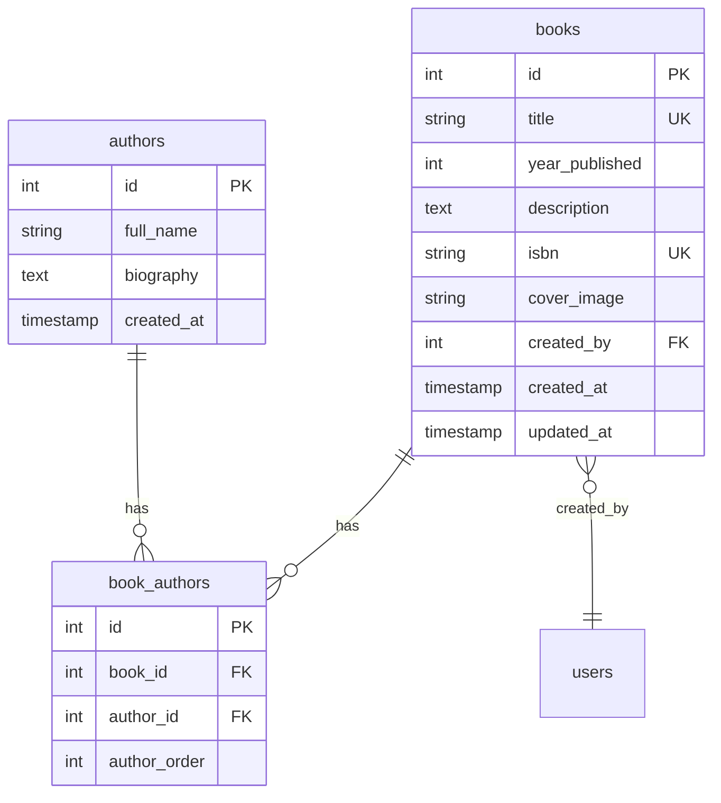

# Plan: Add Sample Data (Books, Authors) in Yii v1

## Overview

Create a console seed command (`SeedCommand.php`) to populate the database with sample Authors and Books data.

## Database Schema Summary



## Implementation Plan

### File to Create

**Path:** `bookz1/protected/commands/SeedCommand.php`

### Command Structure

```php
<?php

/**
 * SeedCommand is a console command for populating sample data.
 * 
 * Usage examples:
 *   ./yiic seed index           # Seed all data
 *   ./yiic seed authors         # Seed only authors
 *   ./yiic seed books           # Seed only books
 *   ./yiic seed clear           # Clear all seeded data
 *   ./yiic seed refresh         # Clear and re-seed all data
 */
class SeedCommand extends CConsoleCommand
{
    // Sample authors data
    private $authors = [
        ['full_name' => 'Александр Пушкин', 'biography' => '...'],
        ['full_name' => 'Лев Толстой', 'biography' => '...'],
        // ... more authors
    ];
    
    // Sample books data with author associations
    private $books = [
        ['title' => '...', 'year_published' => 1833, 'authors' => ['Александр Пушкин']],
        // ... more books
    ];
    
    public function actionIndex() { /* seed all */ }
    public function actionAuthors() { /* seed authors only */ }
    public function actionBooks() { /* seed books only */ }
    public function actionClear() { /* clear all data */ }
    public function actionRefresh() { /* clear and re-seed */ }
}
```

### Sample Data

#### Authors (10 Russian classical writers)
1. Александр Пушкин
2. Лев Толстой
3. Федор Достоевский
4. Антон Чехов
5. Иван Тургенев
6. Николай Гоголь
7. Михаил Булгаков
8. Максим Горький
9. Борис Пастернак
10. Иван Бунин

#### Books (15-20 classic Russian books with author associations)
- Eugene Onegin (Пушкин, 1833)
- War and Peace (Толстой, 1869)
- Crime and Punishment (Достоевский, 1866)
- The Brothers Karamazov (Достоевский, 1880)
- Anna Karenina (Толстой, 1877)
- The Cherry Orchard (Чехов, 1903)
- Fathers and Sons (Тургенев, 1862)
- Dead Souls (Гоголь, 1842)
- The Master and Margarita (Булгаков, 1967)
- And more...

### Key Implementation Details

1. **Transaction Support**: Wrap seeding in database transactions for rollback on errors
2. **Idempotency**: Check if data already exists before inserting (by title/name)
3. **Author Association**: Use `BookAuthor` junction table to link books with authors
4. **Error Handling**: Proper error messages and exit codes
5. **Progress Output**: Show seeding progress in console

### Usage Commands

```bash
# From the bookz1 directory
cd bookz1

# Seed all sample data
./protected/yiic seed

# Or explicitly
./protected/yiic seed index

# Seed only authors
./protected/yiic seed authors

# Seed only books (requires authors to exist)
./protected/yiic seed books

# Clear all seeded data
./protected/yiic seed clear

# Clear and re-seed (fresh start)
./protected/yiic seed refresh
```

## Next Steps

1. Switch to Code mode to create `SeedCommand.php`
2. Test the command by running `./protected/yiic seed`
3. Verify data in database

## Files Affected

| File | Action |
|------|--------|
| `bookz1/protected/commands/SeedCommand.php` | Create (new file) |

## Dependencies

- Existing models: `Author`, `Book`, `BookAuthor`
- Database connection configured in `console.php`
